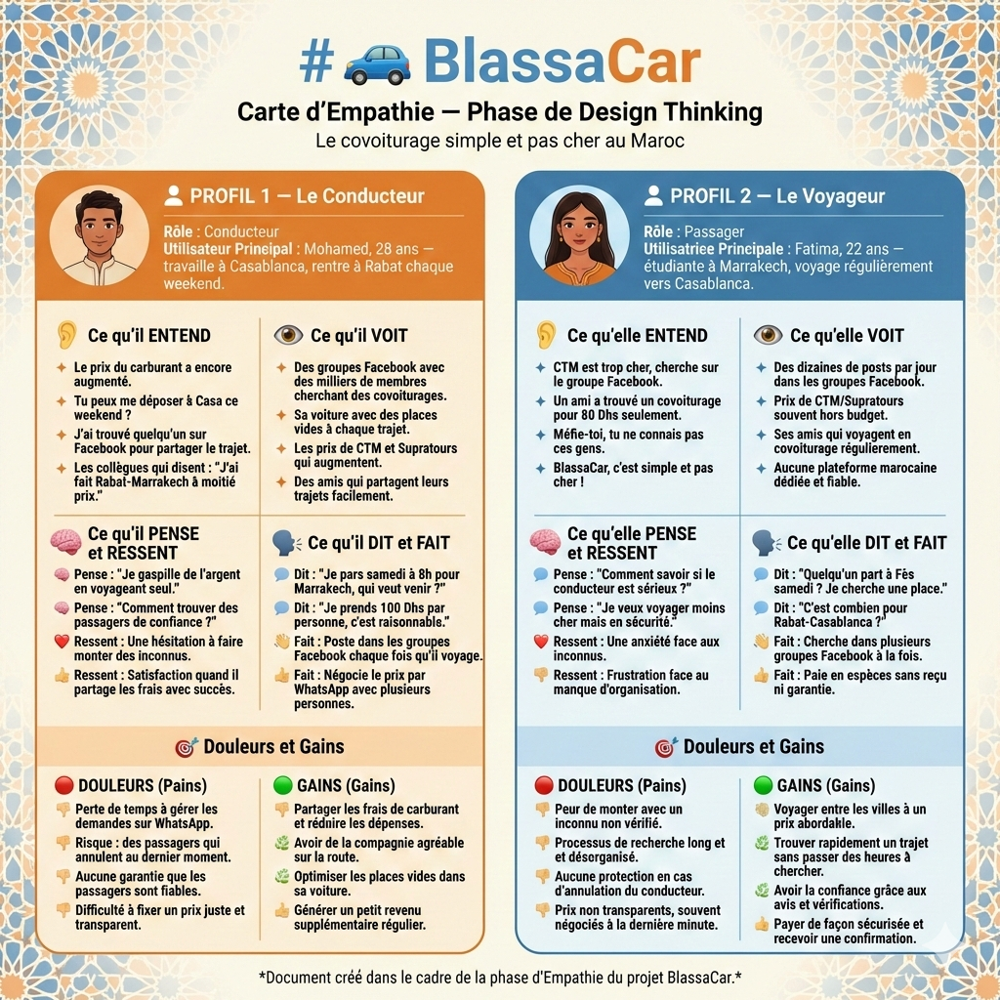

# 🚗 BlassaCar

## Carte d'Empathie — Phase de Design Thinking

_Le covoiturage simple et pas cher au Maroc_

---

## 👤 PROFIL 1 — Le Conducteur

**Rôle : Conducteur**
**Utilisateur Principal : Mohamed, 28 ans** — travaille à Casablanca, rentre à Rabat chaque weekend.

---

### 👂 Ce qu'il ENTEND

- "Le prix du carburant a encore augmenté."
- "Tu peux me déposer à Casa ce weekend ?"
- "J'ai trouvé quelqu'un sur Facebook pour partager le trajet."
- Les collègues qui disent : "J'ai fait Rabat-Marrakech à moitié prix."

### 👁️ Ce qu'il VOIT

- Des groupes Facebook avec des milliers de membres cherchant des covoiturages.
- Sa voiture avec des places vides à chaque trajet.
- Les prix de CTM et Supratours qui augmentent.
- Des amis qui partagent leurs trajets facilement.

### 🧠 Ce qu'il PENSE et RESSENT

- Pense : "Je gaspille de l'argent en voyageant seul."
- Pense : "Comment trouver des passagers de confiance ?"
- Ressent : Une hésitation à faire monter des inconnus.
- Ressent : Satisfaction quand il partage les frais avec succès.

### 🗣️ Ce qu'il DIT et FAIT

- Dit : "Je pars samedi à 8h pour Marrakech, qui veut venir ?"
- Dit : "Je prends 100 Dhs par personne, c'est raisonnable."
- Fait : Poste dans les groupes Facebook chaque fois qu'il voyage.
- Fait : Négocie le prix par WhatsApp avec plusieurs personnes.

### 🎯 Douleurs et Gains

**🔴 DOULEURS (Pains)**

- Perte de temps à gérer les demandes sur WhatsApp.
- Risque : des passagers qui annulent au dernier moment.
- Aucune garantie que les passagers sont fiables.
- Difficulté à fixer un prix juste et transparent.

**🟢 GAINS (Gains)**

- Partager les frais de carburant et réduire les dépenses.
- Avoir de la compagnie agréable sur la route.
- Optimiser les places vides dans sa voiture.
- Générer un petit revenu supplémentaire régulier.

---

## 👤 PROFIL 2 — Le Voyageur

**Rôle : Passager**
**Utilisatrice Principale : Fatima, 22 ans** — étudiante à Marrakech, voyage régulièrement vers Casablanca.

---

### 👂 Ce qu'elle ENTEND

- "CTM est trop cher, cherche sur le groupe Facebook."
- "Un ami a trouvé un covoiturage pour 80 Dhs seulement."
- "Méfie-toi, tu ne connais pas ces gens."
- "BlassaCar, c'est simple et pas cher !"

### 👁️ Ce qu'elle VOIT

- Des dizaines de posts par jour dans les groupes Facebook.
- Prix de CTM/Supratours souvent hors budget.
- Ses amis qui voyagent en covoiturage régulièrement.
- Aucune plateforme marocaine dédiée et fiable.

### 🧠 Ce qu'elle PENSE et RESSENT

- Pense : "Comment savoir si le conducteur est sérieux ?"
- Pense : "Je veux voyager moins cher mais en sécurité."
- Ressent : Une anxiété face aux inconnus.
- Ressent : Frustration face au manque d'organisation.

### 🗣️ Ce qu'elle DIT et FAIT

- Dit : "Quelqu'un part à Fès samedi ? Je cherche une place."
- Dit : "C'est combien pour Rabat-Casablanca ?"
- Fait : Cherche dans plusieurs groupes Facebook à la fois.
- Fait : Paie en espèces sans reçu ni garantie.

### 🎯 Douleurs et Gains

**🔴 DOULEURS (Pains)**

- Peur de monter avec un inconnu non vérifié.
- Processus de recherche long et désorganisé.
- Aucune protection en cas d'annulation du conducteur.
- Prix non transparents, souvent négociés à la dernière minute.

**🟢 GAINS (Gains)**

- Voyager entre les villes à un prix abordable.
- Trouver rapidement un trajet sans passer des heures à chercher.
- Avoir la confiance grâce aux avis et vérifications.
- Payer de façon sécurisée et recevoir une confirmation.

---

_Document créé dans le cadre de la phase d'Empathie du projet BlassaCar._
