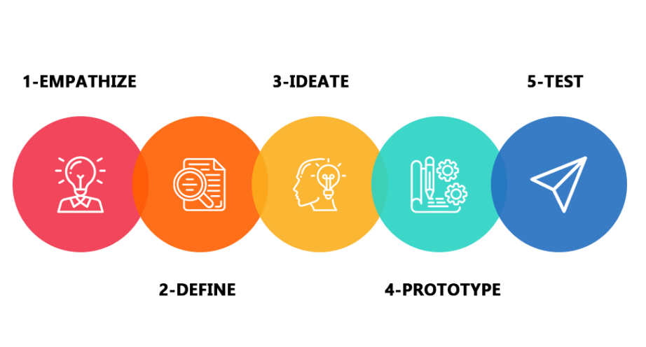
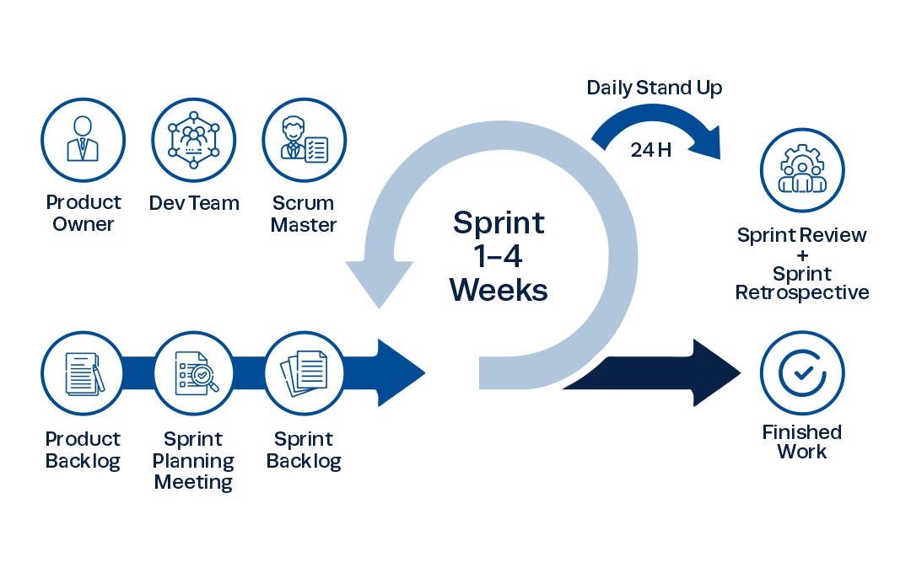
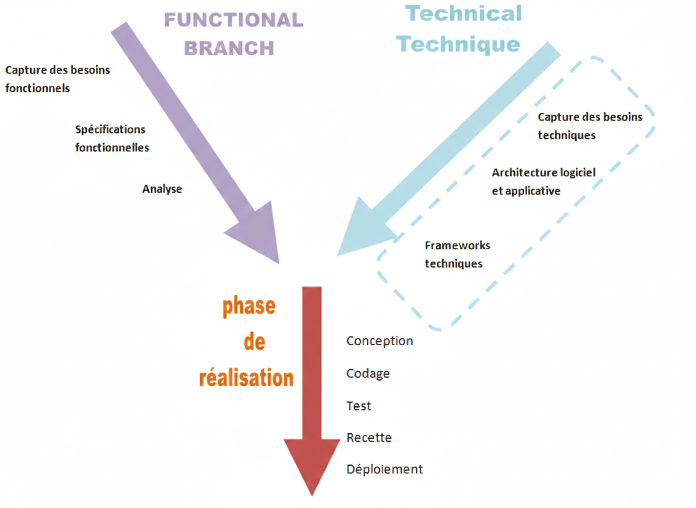
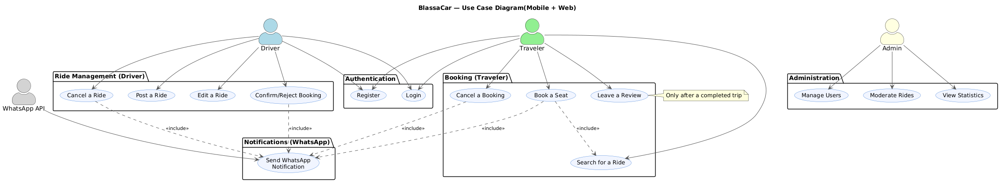
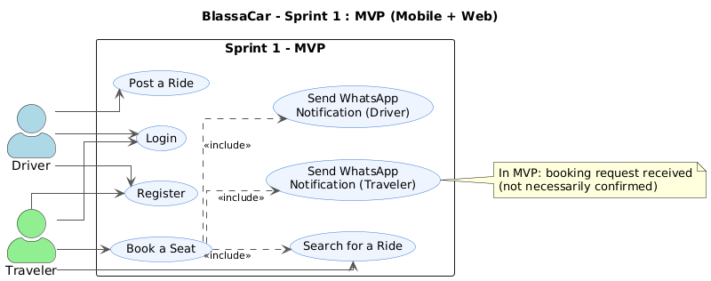
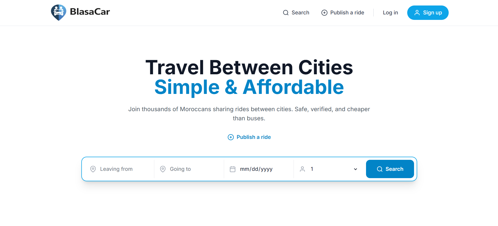
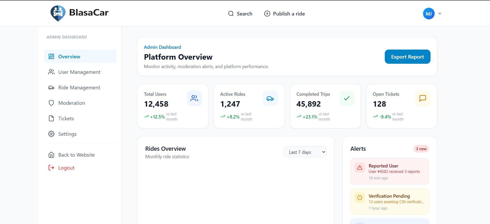
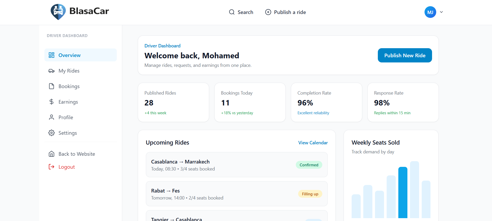
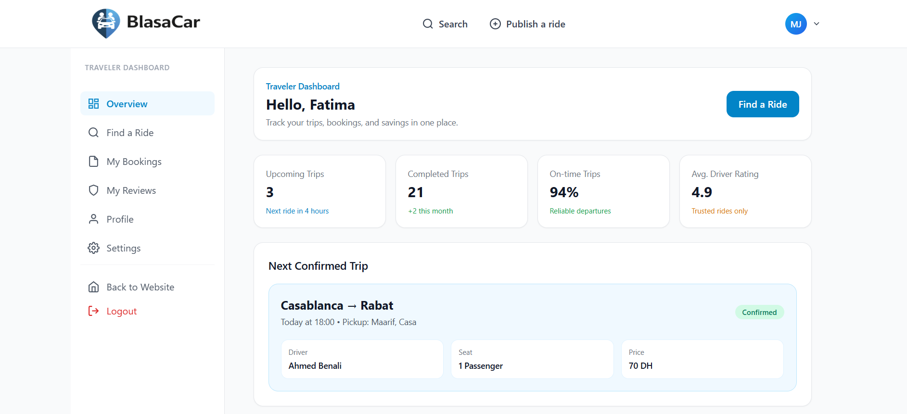
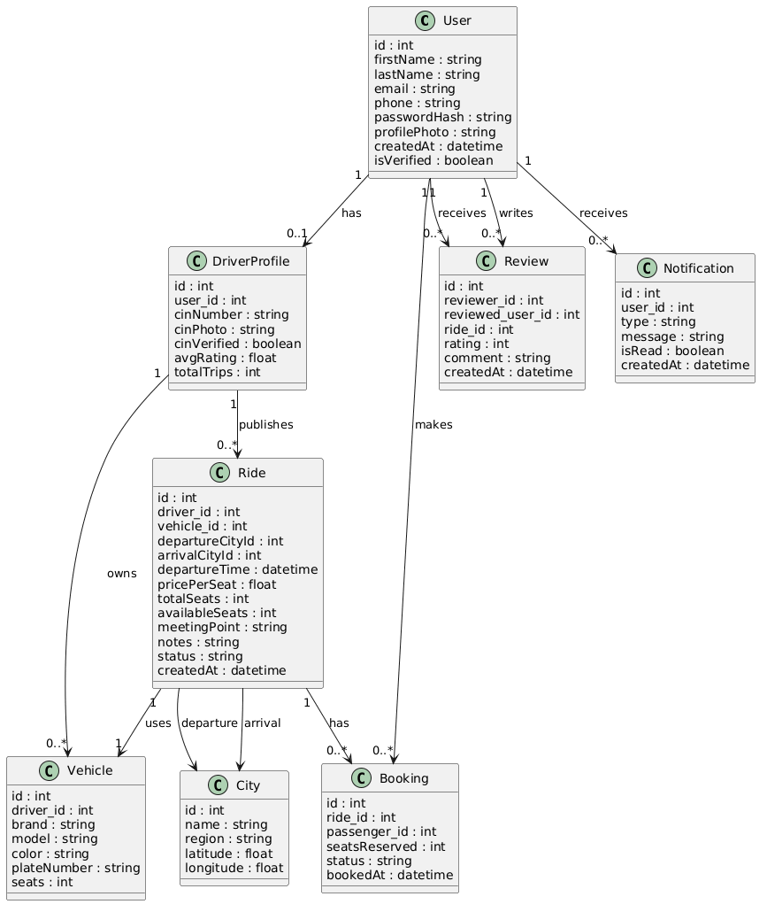

  
  

# **Projet de Fin de Formation**

### BlassaCar — Plateforme de covoiturage entre les villes du Maroc

**Réalisé par :** Ayoub Jalyta  
**Encadré par :** M. ESSARRAJ Fouad  
**Filière :** Développement Mobile et Web

---

## Sommaire

  

1

Contexte du projet

  

2

Méthodologie de travail

  

3

Branche Fonctionnelle

  

4

Branche Technique

  

5

Conception

  

6

Démonstration

  

7

Conclusion

---

## 1. Contexte du projet

  

---

## 2. Méthodologie : Design Thinking

  

---

## Méthodologie : Scrum (Agile)

  

---

## Méthodologie : Processus 2TUP

  

---

## 3. Branche Fonctionnelle : Design Thinking

### 1. EMPATHIE

  

    <h4>Comprendre l'utilisateur</h4>
    <blockquote style="font-style: italic; background: white; padding: 15px; border-radius: 8px;">
      
- <strong>Mohamed (Conducteur, 28 ans)</strong> passe 60% de son temps à gérer des messages WhatsApp pour trouver des passagers. Il veut partager ses frais de carburant mais n'a aucun outil fiable pour organiser ses trajets.

      
- <strong>Fatima (Voyageuse, 22 ans)</strong> cherche des trajets bon marché entre les villes mais ne trouve que des groupes Facebook désorganisés, sans vérification des conducteurs ni garantie de sécurité.

      
- <strong>Karim (Administrateur, 30 ans)</strong> doit modérer manuellement les profils et les trajets sans aucun tableau de bord centralisé, ce qui le rend incapable de détecter les fraudes en temps réel.

    </blockquote>
  

---

## Branche Fonctionnelle : Design Thinking

### 2. DÉFINITION

  

    <h4>Cadrage du problème</h4>
    <blockquote style="font-style: italic; background: white; padding: 15px; border-radius: 8px;">
      
- Comment pourrions-nous <strong>centraliser</strong> la publication et la recherche de trajets en une seule plateforme, sans passer par Facebook ou WhatsApp ?

      
- Comment pourrions-nous <strong>instaurer la confiance</strong> entre conducteurs et voyageurs inconnus grâce à la vérification de profil (CIN + téléphone) et un système de notation ?

      
- Comment pourrions-nous donner à l'administrateur un <strong>tableau de bord proactif</strong> avec alertes en temps réel pour modérer la plateforme efficacement ?

    </blockquote>
  

---

## Branche Fonctionnelle : Design Thinking

### 3. IDÉATION

  

    <h4>Solutions retenues</h4>
    
• Interface de <strong>publication de trajet en 2 minutes</strong> pour le conducteur (from, to, date, seats, price).

    
• <strong>Système de vérification</strong> CIN + téléphone pour instaurer la confiance dès l'inscription.

    
• <strong>Notifications WhatsApp</strong> automatiques à chaque confirmation de réservation.

    
• <strong>Dashboard Admin</strong> avec KPIs en temps réel : trajets actifs, signalements, statistiques.

    
• Modèle de démarrage <strong>gratuit</strong> pour construire la base d'utilisateurs, puis commission de 10% par réservation.

  

---

## Branche Fonctionnelle : Cas d'utilisation

  

---

## Branche Fonctionnelle : Sprint 1 (MVP)

  

---

## Branche Fonctionnelle : Sprint 2

  

---

## Branche Fonctionnelle : Maquettes - Landing Page

  
  
Page d'accueil de la plateforme

---

## Branche Fonctionnelle : Maquettes - Admin

  
  
Tableau de bord de l'administrateur

---

## Branche Fonctionnelle : Maquettes - Chauffeur

  
  
Tableau de bord du conducteur

---

## Branche Fonctionnelle : Maquettes - Voyageur

  
  
Tableau de bord du voyageur

---

## 4. Branche Technique : Tech Stack

  

    <h4>Les technologies à utiliser</h4>
    <ul>
      <li><strong>Base de données:</strong> MySQL </li>
      <li><strong>Framework:</strong> Laravel 12</li>
      <li><strong>Architecture:</strong> N-Tiers</li>
      <strong>Controller:</strong> Requêtes HTTP
      <strong>Service:</strong> Logique métier
      <strong>Model:</strong> Base de données
      <li><strong>Architecture:</strong> MVC</li>
      <li><strong> Blade :</strong>Templates réutilisables (components, layouts).</li>
    </ul>
  

  

    <ul>
      <li><strong>Alpine.js :</strong> Librairie JavaScript pour les interactions dynamiques.</li>
      <li><strong>Spatie :</strong> Librairie pour la gestion des permissions et rôles.</li>
      <li><strong>Vite :</strong> Outil de build rapide.</li>
      <li><strong>Lucide :</strong> Librairie d'icônes.</li>
      <li><strong>Tailwind CSS :</strong> Développement rapide, responsive.</li>
    </ul>
  

---

<!-- _class: class-diagram-slide -->
## 5. Conception : Diagrammes UML

   <h3>Modélisation des données (MLD)</h3>
  

---

## 6. Démonstration : Environnement & Outils

  

    <h4>Environnement de Développement</h4>
    <ul>
      <li><strong>IDE :</strong> VS Code & Antigravity </li>
      <li><strong>Monitoring DB :</strong> Workbench Sql</li>
    </ul>
  

  

    <h4>Gestion & Déploiement</h4>
    <ul>
      <li><strong>Modelisation UML :</strong> Mermaid/PlantUML</li>
      <li><strong>Gestion de version :</strong> Git (GitHub)</li>
      <li><strong>Navigateur :</strong> Chrome DevTools</li>
    </ul>
  

 

---

## 7. Conclusion

- **Objectifs atteints** : Plateforme BlassaCar fonctionnelle et responsive.
- **Compétences** : Maîtrise du cycle Agile, Design Thinking et de la stack Full-stack Laravel.
- **Perspectives** : Intégration d'un module de paiement en ligne (CMI) et d'une application mobile.

 

### Merci pour votre attention !
